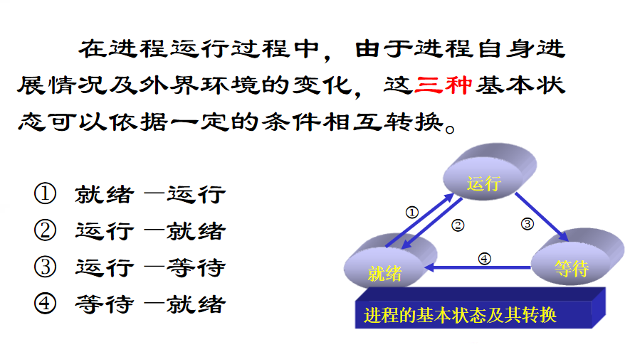
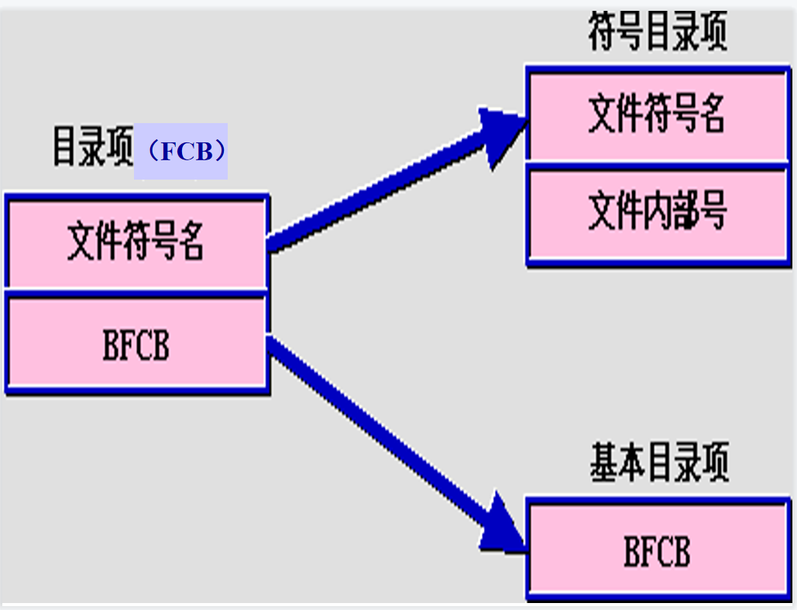

### 一、概述部分

#### 1. 什么是操作系统？操作系统设计目标是什么？由哪些部分组成？各个部分主要解决什么问题？

操作系统是指控制和管理整个计算机系统的硬件和软件资源，并合理地组织和调度计算机的工作和资源的分配，以提供给用户和其它软件方便的接口和环境，它是计算机系统中最基本的系统软件。

目标：

- 作为计算机系统的管理者，具有进程、存储器、设备、文件等四个模块的管理功能
- 作为用户与计算机硬件之间的接口，方便用户快捷、可靠地操纵计算机硬件并运行自己的程序
- 用作扩充机器

操作系统由以下几个功能模块组成：

1. 进程管理。当多个程序同时运行时，解决处理器（CPU）时间的分配问题。
2. 作业管理。完成某个独立任务的程序及其所需的数据组成一个作业。作业管理的任务主要是为用户提供一个使用计算机的界面使其方便地运行自己的作业，并对所有进入系统的作业进行调度和控制，尽可能高效地利用整个系统的资源。
3. 存储器管理。为各个程序及其使用的数据分配存储空间，并保证他们互不干扰。
4. 设备管理。根据用户提出使用设备的请求进行设备分配，同时还能随时接收设备的请求（称为中断），如要求输入信息。
5. 文件管理。主要负责文件的存储、检索、共享和保护，为用户提供文件操作的方便。

#### 2. 操作系统内核技术的发展？什么是微内核？并发和并行的区别？

操作系统的软件体系结构的发展阶段是**单一结构**，**核心层次架构**，**微内核结构**。

微内核结构是以微内核为OS核心，以客户/服务器为基础，采用面向对象程序设计的特征，是当今最有发展前途的OS结构。

并发和并行的最大区别在于并发指的是在一个时间段内，多个进程同步运行，并行是指在同一时间内一起运行。

### 二、进程管理

#### 1. 为什么要引入进程？为什么要引入线程？从调度性、并发性、拥有的资源以及系统开销等方面，区别和比较进程和线程？

引入进程的目的是更好地使多道程序并发执行，提高资源利用率和系统吞吐量。

引入线程的目的是减小程序在并发执行时所付出的时空开销，提高操作系统的并发性能。

- 调度性：线程是独立调度的基本单位，进程是拥有资源的基本单位。在同一进程中，线程的切换不会引起进程切换。在不同进程中进行线程切换，如从一个进程内的线程切换到另一个进程中的线程时，会引起进程切换。
- 并发性：在引入线程的操作系统中，不仅进程之间可以并发执行，而且多个线程之间也可以并发执行，从而使操作系统具有更好的并发性，提高系统吞吐量。

#### 2. 进程状态迁移图，引起状态迁移的原因和事件？

#### 3. 进程组成？PCB 的含义？

进程实体的组成是程序段、相关数据段、PCB。

PCB：进程控制块，描述进程的基本情况和运行状态，是进程唯一存在的标志。

#### 4. 进程之间的关系？什么是临界区？如何实现临界区的互斥访问？

包括无关进程、父子进程、同级进程、协作进程。

临界区即为进程访问临界资源的代码段。

实现临界区的互斥访问可以使用各种同步机制，包括互斥锁或者信号量来进行访问。

#### 5. P/V 操作的含义？信号量的含义？如何定义信号量的初值？如何利用 P/V 操作实现多个进程之间的同步和互斥？如利用其实现单缓冲区的读写问题？如何实现生产者消费者等问题？

#### 6. 高级通信方式中，理解 send()和 receive（）的工作过程。

高级通信方式包括 共享存储、消息传递、管道通信

#### 7. 有哪些常用调度算法？引起进程调度的事件有那些？多级反馈队列调度算法的分析？

- 先来先服务调度算法
- 短作业优先调度算法
- 优先级调度算法
- 时间片轮转调度算法
- 多级反馈队列调度算法

进程调度可能由以下事件引起：

1. 进程创建：当新的进程被创建时，调度程序需要决定如何将其纳入运行队列中。
2. 进程终止：当一个进程完成任务或被终止时，调度程序需要选择下一个要执行的进程。
3. I/O请求：当一个进程发起I/O请求并进入等待状态时，调度程序可以选择切换到另一个可执行的进程。
4. 时间片耗尽：在时间片轮转调度等算法中，当一个进程的时间片用尽时，调度程序会切换到下一个进程。
5. 中断事件：当一个中断事件发生时，如时钟中断、I/O中断等，调度程序可能需要执行一些处理并选择下一个要执行的进程。

多级反馈队列调度算法的分析：

- 是**时间片轮转调度算法**和**优先级调度算法**的**综合与发展**，通过**动态调整进程优先级**和**时间片**大小，多级反馈队列调度算法可以**兼顾多方面的系统目标**——为**提高系统吞吐量和缩短平均周转时间**而**照顾短进程**；为获得**较好的I/O设备利用率和缩短响应时间**而**照顾I/O型进程**；同时，也**不必事先估计进程的执行时间**。
- 优势：1. 终端型作业用户：短作业优先；2. 短批处理作业用户：周转时间较短；3. 长批处理作业用户：经过前面几个队列得到部分执行，不会长期得不到处理。

#### 8. 引起死锁的四个特征是什么？如何针对这四个特征克服死锁？资源分配图的方法判定死锁

- **互斥**：至少有一个资源必须处于互斥模式，即一次只有一个进程使用。如果另一资源申请该资源，那么申请进程必须延迟到该资源释放为止。
- **持有并等待**：一个进程必须占有至少一个资源，并等待另一个资源，而该资源为其他进程所占有。
- **非抢占**：资源不能被抢占，即只有进程完成其任务之后，才会释放其资源。
- **循环等待**：进程{P0，P1，...，Pn}，P0等待的资源为P1所占有，P1等待的资源为P2所占有，Pn-1等待的资源为Pn所占有，Pn等待的资源为P0所占有。

克服死锁：预防死锁、避免死锁、检测和解除死锁

- 如果图不包含环，则不存在死锁。
- 如果图包含环，则
  - 如果每种资源类型只有一个实例，则死锁。
  - 如果每种资源类型存在若干个实例，则只是有可能会发生死锁。

### 三、内存管理

#### 1. 在动态分区分配中，有那些分区分配算法？各个是如何实现的？

- 最先适配算法
  - 算法思想：按**分区先后次序**从头查找，找到符合要求的第一个分区。
  - 算法实质：尽可能**利用存储区低地址空闲区**，尽量在高地址部分保存较大空闲区，以便一旦有分配大空闲区要求时，容易得到满足。
  - 算法优点：分配简单，合并相邻空闲区比较容易
  - 算法缺点：查找总是从表首开始，前面空闲区往往被分割的很小，满足分配要求的可能性低，**查找次数较多**。
- 循环最先适配算法
  - 算法思想：按**分区先后次序**，从**上次分配的分区起**查找（到最后分区时再回到开头），找到符合要求的第一个分区。
  - 算法特点：算法的**分配和释放的时间性能较好**，使**空闲分区分布得更均匀**，但**较大**的空闲分区**不易保留**。
- 最佳适配算法
  - 算法思想：在所有**大于或者等于要求分配长度**的空闲区中挑选一个**最小的分区**，即对该分区所要求分配的大小来说是**最合适**的。**分配后，所剩余的块会最小**。
  - 算法实现：空闲存储管理表采用**从小到大的顺序结构**。
  - 优点：较大的空闲分区可以被保留。
  - 缺点：空闲分区是**按大小**而不是按地址顺序**排列**的，因此释放时，要在整个链表上搜索地址**相邻的空闲区，合并**后，又要**插入**到合适的位置。
- 最坏适配算法
  - 算法思想：分区时**取**所有空闲区中**最大**的一块，把**剩余的块再变成**一个新的小一点的**空闲区**。
  - 算法实现：空闲区按由大到小排序
  - 优点：分配时，只需查找一次就可成功，分配算法很快。
  - 缺点：**最后剩余分区会越来越小，无法运行大程序**。
- 以上的算法存在碎片问题，有提出“紧凑技术”来解决，但仍不够好，从根源上解决引出了离散分配方式。

#### 2. 什么是虚拟存储器？其特征是什么？虚拟存储器容量是如何确定的？

虚拟存储器 是指具有**请求调入功能**和**置换功能**，能从逻辑上**对 内存 容量加以扩充**的一种**存储器系统**。

特点：

- 不连续性：物理内存分配和虚拟地址空间使用的不连续性
- 部分交换：每次作业交换一小部分
- 大空间：提供大范围的虚拟地址空间，其总容量不超过物理内存和外存交换区容量

1.**虚拟扩充**： 不是物理上而是逻辑上扩充了内存容量。

2.**部分装入**： 每个作业不是全部一次性地装入内存，而是只装入一部分。

3.**离散分配**：不必占用连续的内存空间，而是“见缝插针”。

4.**多次对换**：所需的全部程序和数据要分成多次调入内存

虚拟存储器的容量通常由操作系统和硬件的限制决定。操作系统通过管理虚拟内存空间和辅助存储器的分页和分段机制来确定虚拟存储器的容量。硬件的限制包括物理内存的大小和寻址能力，以及辅助存储器的大小。

#### 3. 请求分页技术中，图示两级分页机制？

#### 4. 请求分页机制中，页面置换算法有那些，具体实施页面置换过程？

**页面置换算法**：

- 先进先出算法（FIFO）
  - 选择建立最早的页面被置换
  - 评价：性能较差，抖动现象，Belady现象
- 最佳算法（OPT）
  - 选择“未来不再使用的”或“在离当前最远位置上出现的”页面被置换。
  - 评价：理想算法
- 最近最久未使用算法（LRU）
  - 使用离过去最近作为不远将来的近似，置换最长时间没有使用过的页。
  - 评价：性能接近最佳算法
- 最不常用算法（LFU）
  - 选择到当前时间为止被访问次数最少的页面被置换
  - 每页设置访问计数器，每当页面被访问时，该页面的访问计数器加1
  - 发生缺页中断时，淘汰计数值最小的页面，并把所有计数清零
- 轮转算法（clock）
  - 也称最近未使用算法（NRU），是LRU和FIFO的折衷。
  - 实现方法
    - 每页标志位use，若该页被访问则置use=1
    - 置换时采用一个指针，从当前指针位置开始按地址先后检查各页，寻找use=0的页面作为被置换页，并将指针经过的页修改为use=0，最后指针停留在被置换页的下一个页。

#### 5. 什么是快表？其中内容是什么样子的？什么是页表？其结构是如何？

- **页表指出逻辑地址中的页号与所占主存块号的对应关系**。 作用：页式存储管理在用动态重定位方式装入作业时，要利用页表做地址转换工作。 
- 快表就是存放在**联想寄存器的部分页表**。 它起页表相同的作用。 由于采用页表做地址转换，读写内存数据时CPU要访问两次主存。

### 四、文件管理

#### 1. 什么是文件？什么是文件系统？文件系统设计目标是什么？

**文件**是以计算机硬盘为载体存储在计算机上的信息集合。 由**文件**名，后缀名和路径组成。

文件系统是一种操作系统提供的用于管理和组织文件的软件机制。它定义了文件的存储、访问和操作方式，包括文件的创建、打开、关闭、读取、写入、删除等操作。文件系统还提供了对文件的目录结构、文件的权限和属性、文件的共享和保护等管理功能。

目标包括数据持久性、文件组织和访问、文件共享和保护、保证性能和效率、可靠性和容错性、空间管理、兼容性和可移植性。

#### 2. 什么是文件的逻辑结构、物理结构？文件物理结构有哪些？分别如何实现？有什么特点？

文件的逻辑结构：逻辑结构描述了文件的组织方式和文件中数据元素之间的逻辑关系。它定义了文件中数据的逻辑顺序、数据的类型和数据之间的关联关系。逻辑结构可以根据应用需求选择不同的组织方式，例如线性结构、层次结构、网络结构和关系结构等。

文件的物理结构：物理结构描述了文件在存储介质上的实际存储方式。它定义了如何将文件的逻辑结构映射到存储设备上的实际存储位置。文件的物理结构决定了如何读取和写入文件的数据。

- 顺序文件：顺序文件将数据按照其在文件中出现的顺序进行存储，数据元素之间没有明确的物理关联。顺序文件适合于顺序访问，但不适合于随机访问。
- 索引文件：索引文件在顺序文件的基础上添加了一个索引结构，用于加快对文件中特定数据的查找速度。索引文件包含一个索引表，其中存储了数据元素和其在文件中位置之间的映射关系。通过索引，可以快速定位和访问文件中的数据。
- 索引顺序文件：索引顺序文件结合了顺序文件和索引文件的特点。它将数据按照顺序存储，并在顺序文件上建立索引结构。索引顺序文件可以通过索引进行高效的随机访问，同时也支持按顺序访问。
- 散列文件：散列文件使用散列函数将数据映射到文件中的特定位置，实现了基于关键字的快速访问。每个数据元素根据其关键字计算散列值，并将其存储在散列地址中。散列文件适合于快速查找和更新特定数据。

#### 3. UNIX 系统采用的综合索引方式是如何实现的？有何优点？

在UNIX系统中，综合索引是一种常用的文件索引方式，也称为i节点（inode）索引。每个文件都有一个唯一的i节点，用于存储文件的元数据（如权限、拥有者、大小等）以及指向文件数据块的指针。

综合索引的实现方式如下：

1. 文件系统中维护一个索引节点表（inode table），每个索引节点（i节点）对应一个文件。
2. 索引节点中存储了文件的元数据信息，如文件大小、拥有者、访问权限等。
3. 索引节点还包含一组指针，用于指向文件数据块的物理地址。这些指针可以直接指向数据块，也可以通过间接指针来寻址多个数据块。
4. 对于小型文件，索引节点的指针直接指向数据块，避免了额外的间接寻址开销。而对于大型文件，可以使用间接指针来扩展指针的数量，从而支持更大的文件大小。

综合索引的优点包括：

1. 快速定位：综合索引通过i节点的唯一标识符快速定位到文件的元数据和数据块，无需遍历整个文件系统。这使得文件的访问速度较快。
2. 空间效率高：由于每个文件只需要一个唯一的i节点，不管文件大小如何，都只占用一个i节点的空间。这样可以节省存储空间，并减少了对文件系统的开销。
3. 支持多级索引：综合索引可以使用间接指针来支持大型文件的索引，允许文件系统扩展到更大的存储容量。

#### 4. 磁盘空闲空间的管理方法？图示成组链接法？并说明其优点。

- 空闲表法
- 空链表法
- 位图法
- 成组链接法

成组链接法的优点包括：

1. 空间利用效率高：成组链接法可以减少外部碎片，因为每个块组都是连续的磁盘块，可以最大限度地利用空闲空间。
2. 分配和回收高效：分配和回收空闲块的操作仅涉及链表的更新，不需要对整个磁盘进行扫描。这样可以提高分配和回收的效率。
3. 扩展性强：通过增加新的块组，可以扩展文件系统的存储容量。只需更新空闲块链表即可，无需对现有文件进行移动。

#### 5. 什么是目录文件的组成？采用目标文件的目的？目录的改进方法及其改进性能比较？常用的目录结构？

目录文件的组成包括以下几个重要部分：

1. 文件名：每个文件或子目录都有一个唯一的名称，用于在目录中标识和查找。
2. i节点号（inode number）：目录文件记录了每个文件对应的i节点号，通过该号码可以找到文件的元数据和数据块。
3. 权限和属性：目录文件中还记录了每个文件的权限、拥有者和其他属性信息，用于控制对文件的访问和操作。

采用目录文件的主要目的是为了方便用户组织和访问文件，提供一个层次化的文件系统结构。通过目录文件，用户可以创建和管理文件夹、将文件组织到不同的目录中，以及进行文件的查找和访问。

目录的改进方法及其改进性能比较如下：

1. 线性列表目录：最简单的目录结构，将文件名按顺序记录在一个线性列表中。查找文件时需要逐个比对文件名，效率较低，适用于文件数量较少的情况。
2. 哈希目录：使用哈希函数将文件名映射到目录项的存储位置，加快文件查找速度。但是在哈希冲突时需要解决冲突问题，可能导致存储空间的浪费。
3. 多级目录：将目录结构组织成多级的层次结构，每个目录可以包含子目录和文件。多级目录提供了更好的文件组织方式，但可能导致路径较长和深层次的访问开销。
4. 索引节点目录：在目录文件中引入索引节点（i节点）的概念，用于记录文件的元数据和物理地址。通过i节点可以直接定位文件的数据，提高了文件查找和访问的效率。

常用的目录结构包括树形目录结构、多级目录结构和索引节点目录结构。

#### 6. RAID 的概念？关键技术是什么？

廉价磁盘冗余阵列RAID——SFT-III技术

- 技术特点：并行交叉存取
- 优点：可靠性高、磁盘I/O速度高、性能/价格比高

#### 7. 文件操作中,open 函数实现过程及其完成的内容？

在文件操作中，`open()` 函数用于打开文件，并返回一个文件对象，以便进行后续的读取或写入操作。`open()` 函数的实现过程包括以下几个步骤：

1. 参数验证：`open()` 函数接收多个参数，其中包括文件名、打开模式和可选的其他参数。首先，函数会验证传入的参数是否合法，比如文件名是否存在、模式是否有效等。
2. 文件描述符分配：操作系统为文件分配一个文件描述符（File Descriptor），用于唯一标识该文件。文件描述符是一个非负整数，通常是一个小的整数值。
3. 文件控制块（File Control Block，FCB）的创建：文件控制块是操作系统维护的用于管理文件的数据结构。`open()` 函数会创建一个文件控制块，并将文件描述符和相关的文件信息存储在其中，如文件名、打开模式、文件位置指针等。
4. 文件打开模式的处理：`open()` 函数根据指定的打开模式执行相应的操作。常见的打开模式包括读取（"r"）、写入（"w"）、追加（"a"）等。根据打开模式，函数可能会执行一些额外的操作，比如创建文件（如果文件不存在）、截断文件（如果文件已存在并以写入模式打开）等。
5. 返回文件对象：最后，`open()` 函数返回一个文件对象，该对象可以用于后续的文件读写操作。文件对象封装了对文件的操作方法，可以通过调用这些方法来读取或写入文件的数据。

完成这些步骤后，`open()` 函数就完成了文件的打开操作，并返回一个可用的文件对象，供用户进行文件读写操作。

#### 8. 影响磁盘访问的因素有那些？列举几种磁盘调度算法？

寻道时间、旋转延迟、传输时间、块大小、缓存机制、磁盘队列、文件系统布局、并发访问

- 先来先服务
  - 优点：简单，公平
  - 缺点：效率不高，相邻两次请求可能会造成最内到最外的柱面寻道，使磁头反复移动，增加了服务时间，对机械也不利。

- 最短寻道时间优先
  - 优先选择距当前磁头最近的访问请求进行服务，主要考虑寻道优先
  - 优点：改善了磁盘平均服务时间
  - 缺点：造成某些访问请求长期等待得不到服务（不公平、饥饿）

- 扫描算法（电梯算法）
  - 由最短寻道改进而来，一个方向上经过的所有最近点都能被扫描到【即单向的最短寻道】
  - 但会到达全局最远处和最近处（虽然没有要求到这里）

- 单向扫描算法
  - 相比于扫描算法，只会到达访问队列中要求的最高点和最低点